# Implementing a Multi-Environment Application Deployment with Kustomize

## Table of Contents

1. [Introduction](#introduction)
   - [What is Kustomize?](#what-is-kustomize)
   - [Key Concepts](#key-concepts)
2. [Project Structure](#project-structure)
3. [Prerequisites](#prerequisites)
4. [Setting Up the Environment](#setting-up-the-environment)
   - [Installing Required Tools](#installing-required-tools)
   - [Provisioning Kubernetes Cluster with eksctl](#provisioning-kubernetes-cluster-with-eksctl)
   - [Cloning the Repository](#cloning-the-repository)
5. [Understanding the Configuration](#understanding-the-configuration)
   - [Base Configuration](#base-configuration)
   - [Environment Overlays](#environment-overlays)
     - [Development Environment](#development-environment)
     - [Staging Environment](#staging-environment)
     - [Production Environment](#production-environment)
   - [Service Account and RBAC](#service-account-and-rbac)
6. [Deployment Guide](#deployment-guide)
   - [Deploying to Development](#deploying-to-development)
   - [Deploying to Staging](#deploying-to-staging)
   - [Deploying to Production](#deploying-to-production)
   - [Verifying Deployments](#verifying-deployments)
7. [CI/CD Pipeline](#ci-cd-pipeline)
   - [Setting Up GitHub Actions](#setting-up-github-actions)
   - [Pipeline Configuration](#pipeline-configuration)
   - [Testing the Pipeline](#testing-the-pipeline)
8. [Troubleshooting](#troubleshooting)
   - [Common Deployment Issues](#common-deployment-issues)
   - [GitHub Actions Issues](#github-actions-issues)
   - [Kustomize Build Issues](#kustomize-build-issues)
9. [Cleanup](#cleanup)
   - [Removing Deployments](#removing-deployments)
   - [Deleting the Cluster](#deleting-the-cluster)
10. [References and Resources](#references-and-resources)

---

## Introduction

### What is Kustomize?

Kustomize is a Kubernetes-native configuration management tool that allows you to customize application manifests without modifying the original YAML files. It provides a way to manage configurations for different environments (e.g., dev, staging, prod) using overlays and bases.

The application deployed in this project is a simple Node.js web application that displays the day of the week. This app serves as a sample for multi-environment deployment using Kubernetes.


### Key Concepts

- **Base**: Contains common resources shared across environments.

- **Overlay**: Customizes the base for specific environments.

- **Transformers**: Modify resources dynamically, such as adding labels or annotations.

  Example:

  ```yaml
  apiVersion: builtin
  kind: LabelTransformer
  metadata:
    name: add-common-labels
  labels:
    app.kubernetes.io/managed-by: kustomize
    project: kustomize-capstone
  fieldSpecs:
    - path: metadata/labels
      create: true
  ```

- **Generators**: Create ConfigMaps and Secrets dynamically from literals or files.

  Example:

  ```yaml
  configMapGenerator:
    - name: webapp-config
      literals:
        - APP_MODE=base
        - FEATURE_FLAG=false
  secretGenerator:
    - name: webapp-secret
      literals:
        - DB_PASSWORD=pleasechangeme
        - API_KEY=pleasechangeme
  ```

## Project Structure

The project follows a standard Kustomize structure with base configurations and environment-specific overlays:

```plaintext
<project-root>/
├── base/                # Base Kustomize resources (Deployment, Service, ConfigMap, Secret, transformers)
├── overlays/
│   ├── dev/             # Dev environment overlay
│   ├── staging/         # Staging environment overlay
│   └── prod/            # Production environment overlay
└── .github/workflows/   # CI/CD pipeline definition
```


## Prerequisites

Before starting, ensure you have the following:

- AWS CLI installed and configured
- kubectl installed
- eksctl installed
- Git installed
- Access to a GitHub account (for CI/CD setup)
- Basic understanding of Kubernetes concepts (pods, deployments, services, etc.)
- Familiarity with YAML syntax and Kustomize concepts

## Setting Up the Environment

### Installing Required Tools

1. **Install kubectl**:

   ```bash
   curl -LO "https://dl.k8s.io/release/$(curl -L -s https://dl.k8s.io/release/stable.txt)/bin/linux/amd64/kubectl"
   chmod +x kubectl
   sudo mv kubectl /usr/local/bin/
   ```

2. **Install Kustomize**:

   ```bash
   curl -s "https://raw.githubusercontent.com/kubernetes-sigs/kustomize/master/hack/install_kustomize.sh" | bash
   sudo mv kustomize /usr/local/bin/
   ```

### Provisioning Kubernetes Cluster with eksctl

1. **Install eksctl**:

   ```bash
   curl --silent --location "https://github.com/weaveworks/eksctl/releases/latest/download/eksctl_$(uname -s)_$(uname -m).tar.gz" | tar xz -C /tmp
   sudo mv /tmp/eksctl /usr/local/bin
   ```

2. **Create a Kubernetes cluster**:

   ```bash
   eksctl create cluster --name kustomize-cluster --region us-west-2 --nodegroup-name standard-workers --node-type t3.medium --nodes 3
   ```
   **Expected Output**:
   

3. **Verify the cluster is running**:

   ```bash
   kubectl get nodes
   ```

   **Expected Output**:
   

   You should see your nodes listed with status "Ready".

   **EKS Console View**:
   After the cluster is created, you can view it in the AWS EKS console. Navigate to the EKS service in the AWS Management Console, select your cluster, and check the status.
   

### Cloning the Repository

1. **Clone the repository**:

   ```bash
   git clone https://github.com/your-repo/multi-environment-app-deployment-with-kustomize.git
   cd multi-environment-app-deployment-with-kustomize
   ```

   *Replace `your-repo` with the actual GitHub username or organization name.*

   **Expected Output:**
   

## Understanding the Configuration

### Base Configuration

The `base/` directory contains the common Kubernetes resources shared across all environments. These include:

1. **Deployment (`base/deployment.yaml`)**:
   - Defines the application pods and their specifications
   - Sets up container image, ports, and basic resource requests
   - References the service account for pod identity

2. **Service (`base/service.yaml`)**:
   - Exposes the application to the network
   - Defines service type and port mappings

3. **Service Account (`base/service-account.yaml`)**:
   - Creates a dedicated service account for the application
   - Provides identity for pods and CI/CD operations
   - Enables secure access to Kubernetes API

4. **Role and Role Binding (`base/role-binding.yaml`)**:
   - Defines permissions for the service account
   - Grants access to specific resources (pods, configmaps, secrets)
   - Establishes proper RBAC controls for the application

5. **Labels Transformer (`base/labels-transformer.yaml`)**:
   - Adds common labels to all resources
   - Ensures consistent labeling across environments

6. **ConfigMap and Secret Generators**:
   - Dynamically creates configuration and secrets
   - Defines default environment variables

   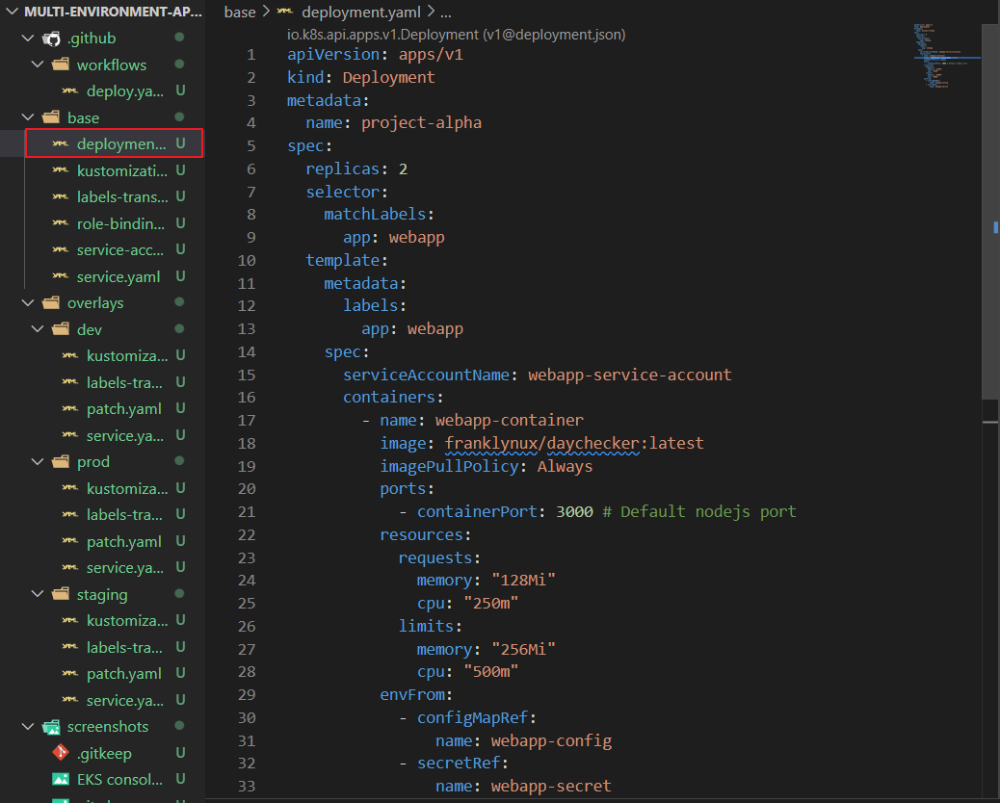
   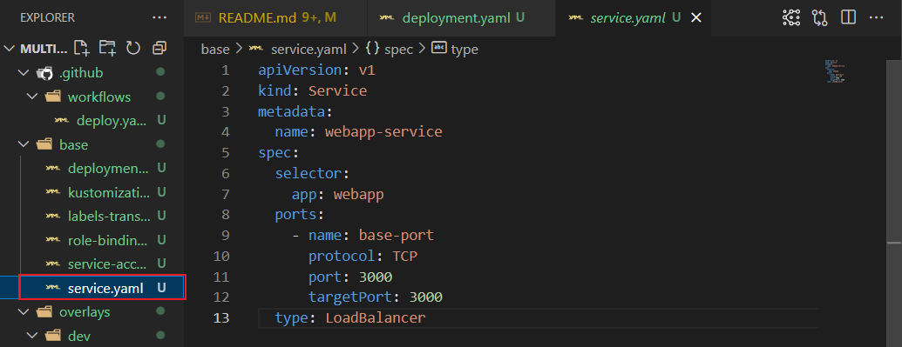
   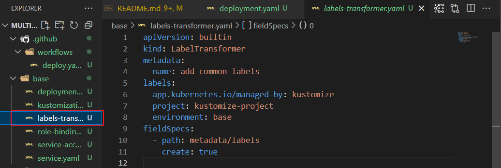
   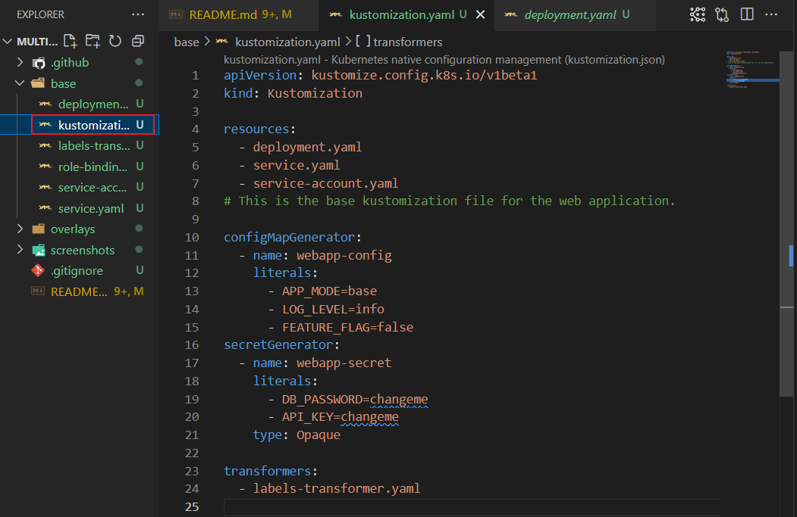

### Environment Overlays

Each environment has its own overlay directory that customizes the base configuration.

#### Development Environment

The `overlays/dev/` directory customizes the base configuration for the development environment:

1. **Patch (`overlays/dev/deployment-patch.yaml`)**:
   - Sets replicas to 1 (minimal resources for development)
   - Configures environment-specific variables
   - Sets resource limits appropriate for development

2. **Labels Transformer (`overlays/dev/labels-transformer.yaml`)**:
   - Adds `environment: dev` label
   - Adds other development-specific labels

   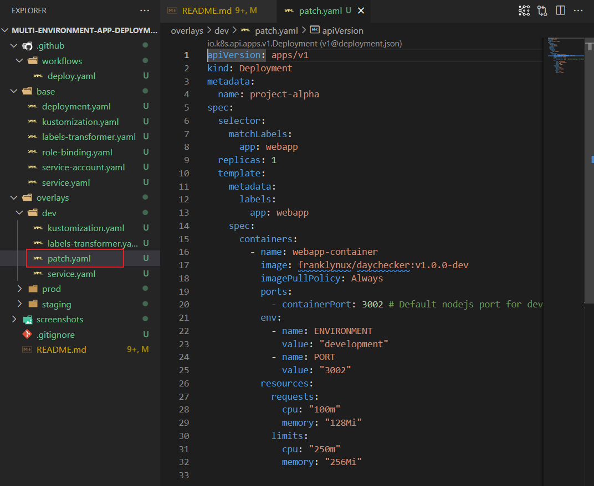
   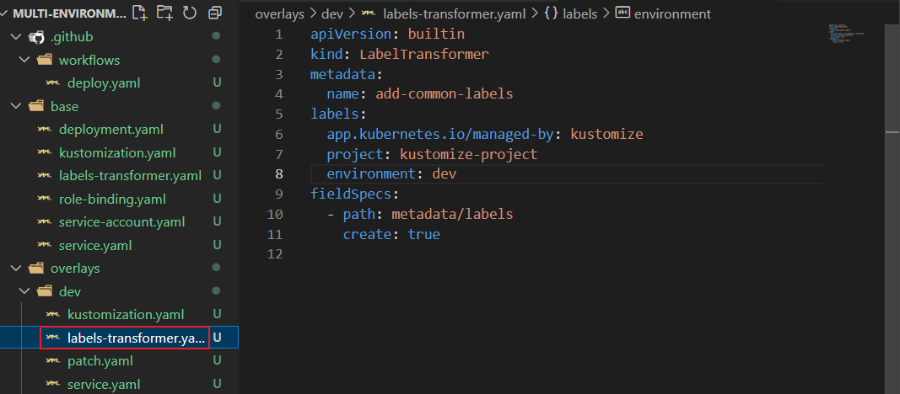
   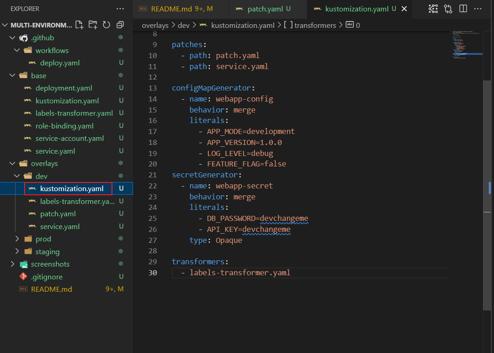

#### Staging Environment

The `overlays/staging/` directory customizes the base configuration for the staging environment:

1. **Patch (`overlays/staging/deployment-patch.yaml`)**:
   - Sets replicas to 2 (moderate redundancy for testing)
   - Configures staging-specific environment variables
   - Sets appropriate resource limits for staging

2. **Labels Transformer (`overlays/staging/labels-transformer.yaml`)**:
   - Adds `environment: staging` label
   - Adds other staging-specific labels

   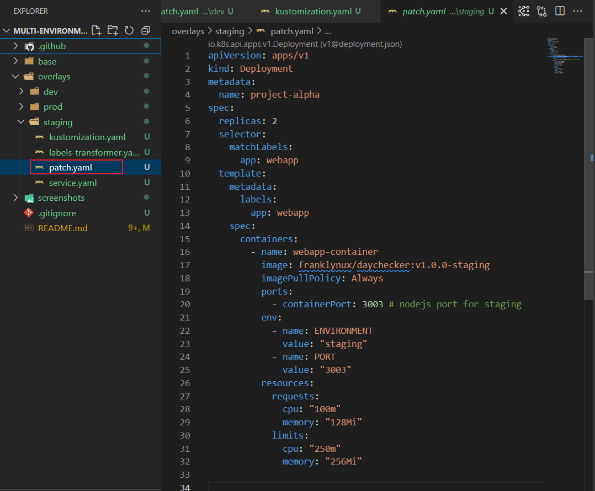
   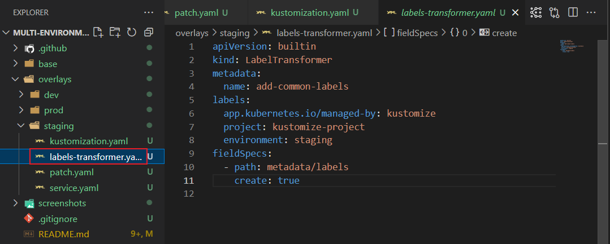
   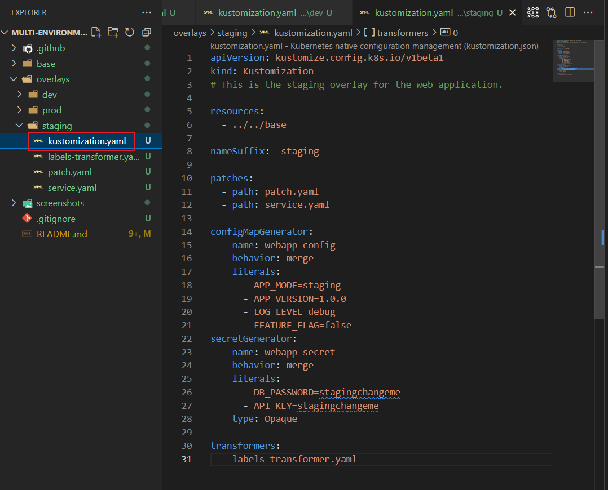

#### Production Environment

The `overlays/prod/` directory customizes the base configuration for the production environment:

1. **Patch (`overlays/prod/deployment-patch.yaml`)**:
   - Sets replicas to 3 (high availability for production)
   - Configures production-specific environment variables
   - Sets higher resource limits for production workloads

2. **Labels Transformer (`overlays/prod/labels-transformer.yaml`)**:
   - Adds `environment: prod` label
   - Adds other production-specific labels

   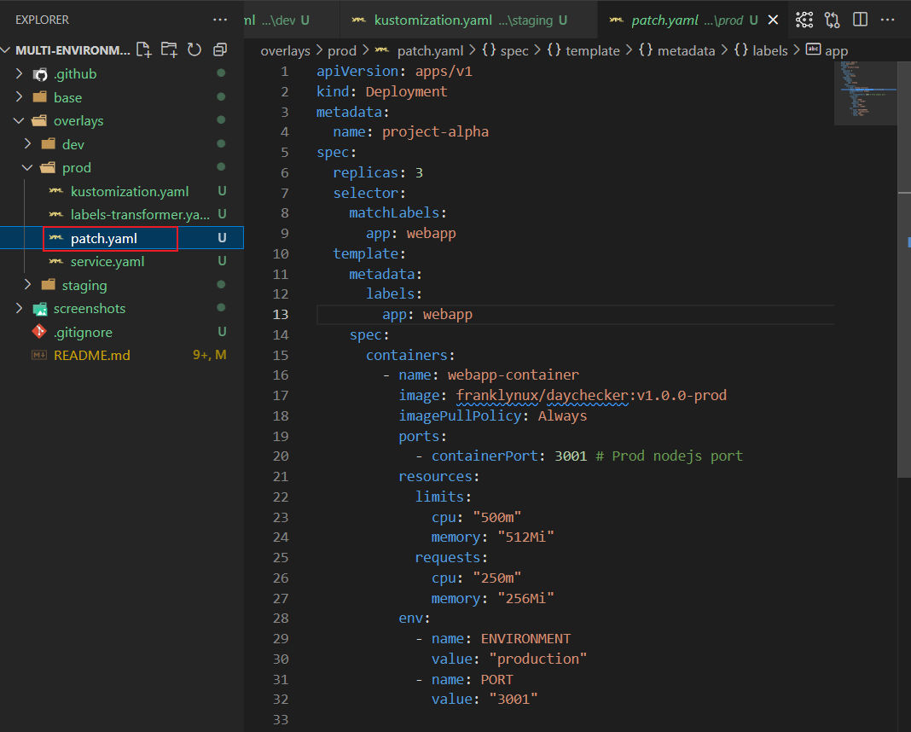
   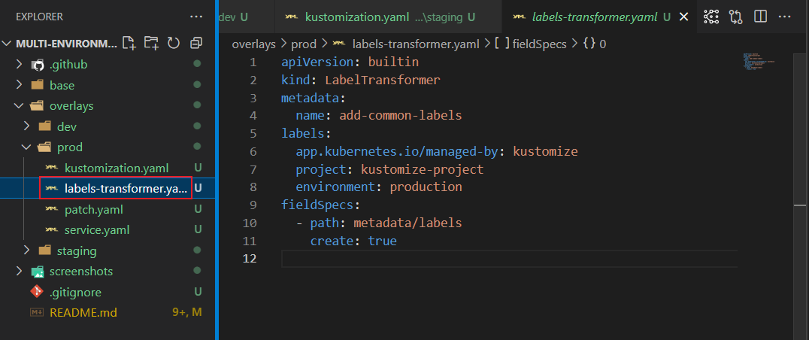
   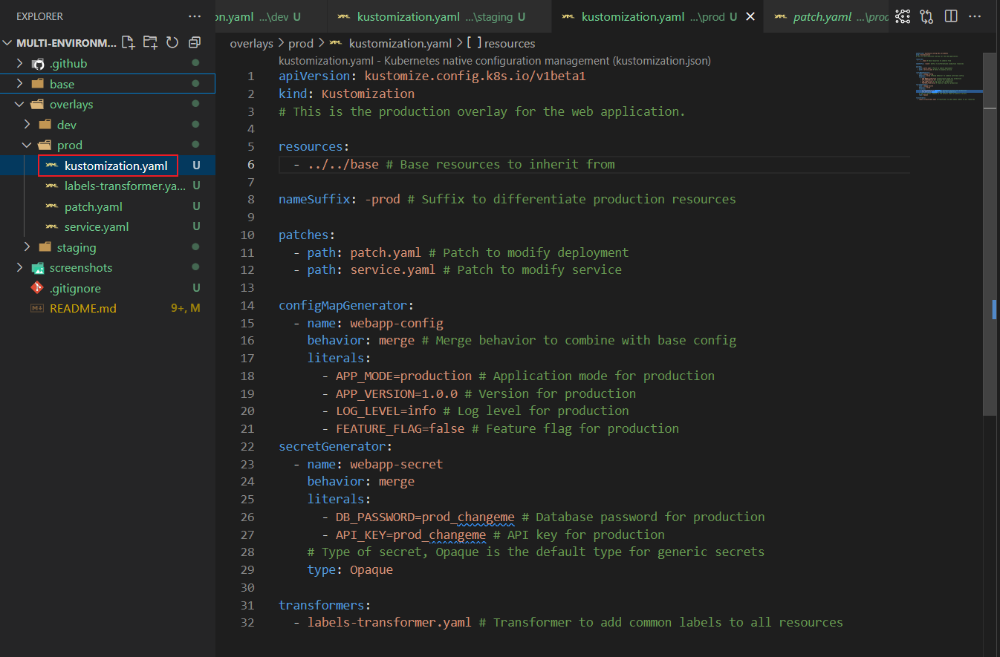

### Service Account and RBAC

A custom service account is created to provide a secure identity for the application pods and the CI/CD pipeline. This service account, along with appropriate Role-Based Access Control (RBAC) permissions, ensures secure access to the Kubernetes API and effective resource management.

1. **Service Account (`base/service-account.yaml`)**:

   ```yaml
   apiVersion: v1
   kind: ServiceAccount
   metadata:
     name: webapp-service-account
     namespace: default
   ```

2. **Role and Role Binding (`base/role-binding.yaml`)**:

   ```yaml
   apiVersion: rbac.authorization.k8s.io/v1
   kind: Role
   metadata:
     name: webapp-role
     namespace: default
   rules:
   - apiGroups: [""]
     resources: ["pods", "configmaps", "secrets"]
     verbs: ["get", "list", "watch", "create", "update", "delete"]
   ---
   apiVersion: rbac.authorization.k8s.io/v1
   kind: RoleBinding
   metadata:
     name: webapp-role-binding
     namespace: default
   subjects:
   - kind: ServiceAccount
     name: webapp-service-account
     namespace: default
   roleRef:
     kind: Role
     name: webapp-role
     apiGroup: rbac.authorization.k8s.io
   ```

The role grants permissions to `get`, `list`, `watch`, `create`, `update`, and `delete` operations on `pods`, `configmaps`, and `secrets` resources within the `default` namespace.


## Deployment Guide

### Deploying to Development

1. **Build and apply the development overlay**:

   ```bash
   kustomize build overlays/dev | kubectl apply -f -
   ```

2. **Verify the deployment**:

   ```bash
   kubectl get deployments,pods,svc -l environment=dev
   ```

   
   

### Deploying to Staging

1. **Build and apply the staging overlay**:

   ```bash
   kustomize build overlays/staging | kubectl apply -f -
   ```

2. **Verify the deployment**:

   ```bash
   kubectl get deployments,pods,svc -l environment=staging
   ```

   
   

### Deploying to Production

1. **Build and apply the production overlay**:

   ```bash
   kustomize build overlays/prod | kubectl apply -f -
   ```

2. **Verify the deployment**:

   ```bash
   kubectl get deployments,pods,svc -l environment=prod
   ```

   
   

### Verifying Deployments

1. **Get the LoadBalancer service endpoint**:

   ```bash
   kubectl get svc
   ```

   Look for the service with `TYPE` as `LoadBalancer` and note the `EXTERNAL-IP` or `EXTERNAL-DNS`.

2. **Access the application**:
   Open a web browser and navigate to the `EXTERNAL-IP` or `EXTERNAL-DNS` obtained in the previous step.

3. **Check pod logs**:

   ```bash
   kubectl logs pods/project-alpha-prod-7cfc67b888-ft6hg
   ```

   
   
   

## CI-CD Pipeline

### Setting Up GitHub Actions

1. **Create the service account token secret**:

   First, create a file named `webapp-token-secret.yaml` in the base directory:

   ```yaml
   apiVersion: v1
   kind: Secret
   metadata:
     name: webapp-secret-token
     annotations:
       kubernetes.io/service-account.name: webapp-service-account
   type: kubernetes.io/service-account-token
   ```

   Then, add it to your base kustomization.yaml resources:

   ```yaml
   resources:
     - deployment.yaml
     - service.yaml
     - service-account.yaml
     - role-binding.yaml
     - webapp-token-secret.yaml
   ```

   Apply the configuration to create the token:

   ```bash
   kubectl apply -f base/webapp-token-secret.yaml
   ```

    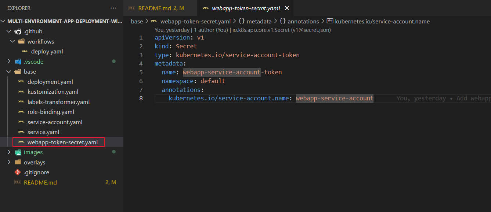

2. **Get the service account token**:

   ```bash
   # For Linux/macOS
   kubectl get secret webapp-secret-token -o jsonpath="{.data.token}" | base64 --decode
   
   # For Windows PowerShell
   kubectl get secret webapp-secret-token -o jsonpath="{.data.token}" | ForEach-Object { [System.Text.Encoding]::UTF8.GetString([System.Convert]::FromBase64String($_)) }
   ```

3. **Get the cluster certificate**:

   ```bash
   # For Linux/macOS/Windows
   kubectl get secret webapp-secret-token -o jsonpath="{.data['ca\.crt']}"
   ```

### Pipeline Configuration

1. **Add AWS credentials and EKS cluster name as GitHub secrets**:

   - Go to your GitHub repository
   - Navigate to Settings > Secrets and variables > Actions > New repository secret
   - Add the following secrets:
     - `AWS_ACCESS_KEY_ID`: Your AWS access key
     - `AWS_SECRET_ACCESS_KEY`: Your AWS secret key
     - `EKS_CLUSTER_NAME`: Your EKS cluster name (e.g., kustomize-app-cluster)

     

2. **Create and replace your kubeconfig file with service account credentials**:

   ```bash
   # For Linux/macOS
   CA_CERT=$(kubectl get secret webapp-secret-token -o jsonpath="{.data['ca\.crt']}")
   SERVER=$(kubectl config view --minify -o jsonpath='{.clusters[0].cluster.server}')
   TOKEN=$(kubectl get secret webapp-secret-token -o jsonpath="{.data.token}" | base64 --decode)
   
   # Create and replace kubeconfig
   cat > ~/.kube/config << EOF
   apiVersion: v1
   kind: Config
   clusters:
   - name: kubernetes
     cluster:
       certificate-authority-data: ${CA_CERT}
       server: ${SERVER}
   contexts:
   - name: webapp-service-account@kubernetes
     context:
       cluster: kubernetes
       user: webapp-service-account
   current-context: webapp-service-account@kubernetes
   users:
   - name: webapp-service-account
     user:
       token: ${TOKEN}
   EOF
   ```

   **Expected Output:**
   The kubeconfig file will be created at `~/.kube/config` with the service account credentials.
   

   ```powershell
   # For Windows PowerShell
   $CA_CERT = kubectl get secret webapp-secret-token -o jsonpath="{.data['ca\.crt']}"
   $SERVER = kubectl config view --minify -o jsonpath='{.clusters[0].cluster.server}'
   $TOKEN = kubectl get secret webapp-secret-token -o jsonpath="{.data.token}" | ForEach-Object { [System.Text.Encoding]::UTF8.GetString([System.Convert]::FromBase64String($_)) }
   
   # Create and replace kubeconfig
   $kubeConfigContent = @"
   apiVersion: v1
   kind: Config
   clusters:
   - name: kubernetes
     cluster:
       certificate-authority-data: ${CA_CERT}
       server: ${SERVER}
   contexts:
   - name: webapp-service-account@kubernetes
     context:
       cluster: kubernetes
       user: webapp-service-account
   current-context: webapp-service-account@kubernetes
   users:
   - name: webapp-service-account
     user:
       token: ${TOKEN}
   "@
   
   New-Item -Path "$env:USERPROFILE\.kube" -ItemType Directory -Force
   $kubeConfigContent | Out-File "$env:USERPROFILE\.kube\config" -Encoding utf8 -Force
   
   ```

3. **Create the workflow file**:
   The workflow file is located at `.github/workflows/deploy.yaml` and defines the CI/CD pipeline:

   

### Testing the Pipeline

1. **Make a change to the repository**:
   - Modify a file in any of the overlays, e.g., in the `overlays/dev` directory, change the replicas in the `patch.yaml` file to 2.
   - Commit and push the changes

2. **Monitor the GitHub Actions workflow**:
   - Go to the Actions tab in your GitHub repository
   - Watch the workflow execution
   - Check for successful deployment

    
    
    

## Troubleshooting

### Common Deployment Issues

1. **Pod Startup Failures**:
   - Check pod status: `kubectl get pods -l app=webapp`
   - View detailed pod information: `kubectl describe pod <pod-name>`
   - Check pod logs: `kubectl logs <pod-name>`

2. **Service Connectivity Issues**:
   - Verify service exists: `kubectl get svc -l app=webapp`
   - Check service endpoints: `kubectl get endpoints <service-name>`
   - Test connectivity from within the cluster: `kubectl run -it --rm --restart=Never test-pod --image=busybox -- wget -O- <service-name>:<port>`

3. **Resource Constraints**:
   - Check node resources: `kubectl describe nodes`
   - Verify pod resource requests and limits: `kubectl describe pod <pod-name>`

4. **ConfigMap and Secret Issues**:
   - Verify ConfigMaps exist: `kubectl get configmaps`
   - Check Secret existence: `kubectl get secrets`
   - Ensure they're mounted correctly in the pod: `kubectl describe pod <pod-name>`
5. **RBAC Issues**:
   - Check service account permissions: `kubectl describe role webapp-role`
   - Verify role binding: `kubectl describe rolebinding webapp-role-binding`
   - Ensure the service account is correctly referenced in the deployment: `kubectl get deployment <deployment-name> -o yaml`

### GitHub Actions Issues

1. **Authentication Failures**:
   - Verify the AWS credentials are correctly set
   - Check that the EKS cluster name is correct
   - Ensure the IAM user has appropriate permissions for EKS

2. **Workflow Failures**:
   - Check the GitHub Actions logs for specific error messages
   - Verify that all required tools are installed in the workflow
   - Test the commands locally with the same kubeconfig

3. **Kustomize Build Errors in CI/CD**:
   - Validate kustomization files locally: `kustomize build overlays/<env>`
   - Check for syntax errors in YAML files
   - Ensure all referenced files exist in the repository

### Kustomize Build Issues

1. **Resource Not Found Errors**:
   - Ensure all referenced resources exist
   - Check file paths in kustomization.yaml
   - Verify that patches correctly target resources

2. **Patch Application Failures**:
   - Ensure patch selectors match target resources
   - Check for YAML syntax errors
   - Verify that the patch structure matches the resource structure

3. **Transformer Issues**:
   - Validate transformer configuration
   - Check that fieldSpecs correctly target fields
   - Test transformers individually

## Cleanup

### Removing Deployments

1. **Delete individual environment deployments**:

   ```bash

   # Delete development environment
   kubectl delete -k overlays/dev

   # Delete staging environment
   kubectl delete -k overlays/staging
   
   # Delete production environment
   kubectl delete -k overlays/prod

   # Delete base resources
   kubectl delete -k base

   # or optionally delete all resources with the label app=webapp
   kubectl delete all -l app=webapp
   ```

2. **Verify resources are removed**:

   ```bash
   kubectl get all -l app=webapp
   ```

   **Expected Output**: No resources found
   

   **Verify Resources Removed**:
   If the resources were successfully deleted, you should see no resources listed.
   

### Deleting the Cluster

1. **Delete the EKS cluster**:

   ```bash
   eksctl delete cluster --name kustomize-app-cluster --region us-east-1
   ```

   **Expected Output**: The command will output the progress of the deletion process, and you should see a confirmation message once the cluster is deleted.
   

2. **Verify cluster deletion**:

   ```bash
   aws eks list-clusters --region us-east-1
   ```

   **Expected Output**: The command should return an empty list if the cluster was successfully deleted.
   

## References and Resources

- [Kustomize Documentation](https://kubectl.docs.kubernetes.io/references/kustomize/)
- [eksctl Documentation](https://eksctl.io/)
- [GitHub Actions for Kubernetes](https://github.com/marketplace/actions/kubectl-tool-installer)
- [Kubernetes RBAC Documentation](https://kubernetes.io/docs/reference/access-authn-authz/rbac/)
- [AWS EKS Documentation](https://docs.aws.amazon.com/eks/latest/userguide/what-is-eks.html)
